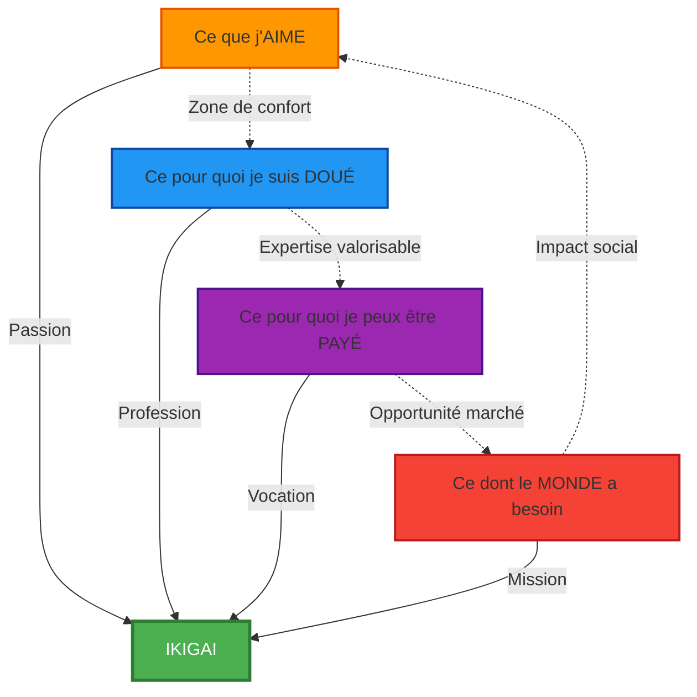
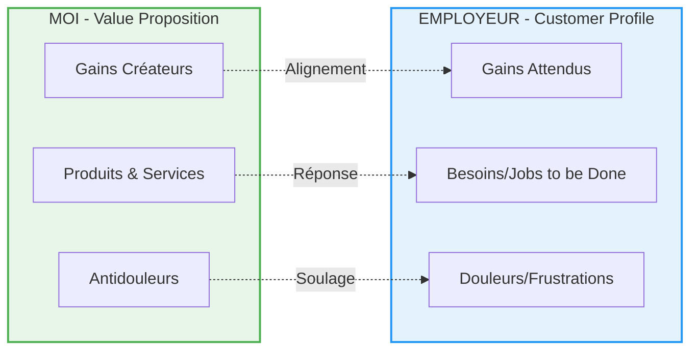

# BIBLIOTHÈQUE FONDAMENTALE CARRIÈRE v3.0 - TALENTXPERT

## [CORE] Protocoles & Modèles Mentaux

### 1. Biais Carrière (Analyse Cognitive)

| Biais | Description | Question de Contre-Mesure (Adaptée au Niveau) |
| :--- | :--- | :--- |
| **Ancrage** | Négociation salariale : le premier chiffre influence tout. | **Junior :** "Quel est le vrai marché pour ce poste, au-delà de votre première recherche Google ?"<br>**Confirmé :** "Quelle est la fourchette haute pour ce poste dans 3 entreprises concurrentes ?"<br>**Dirigeant :** "Quel est le coût de votre expertise pour l'entreprise, pas seulement votre valeur personnelle ?" |
| **Aversion à la Perte** | Peur de quitter un poste médiocre (le connu vs l'inconnu). | "Quel est le coût précis (financier, émotionnel, carrière) de rester encore 6 mois dans ce poste ?" (Coût de l'inaction). |
| **Représentativité** | Se croire "hors profil" ou ne pas "ressembler" au poste. | "Listez 3 compétences transversales de votre ancien job qui sont cruciales dans le nouveau, même si le secteur est différent." |
| **Excès de Confiance** | Surestimation de ses capacités face au marché ou à l'IA. | "Qui est le meilleur candidat que vous ayez rencontré jusqu'ici ? Qu'a-t-il de plus que vous ?" (Humilité forcée). |
| **Effet de Halo** | Un diplôme/titre prestigieux masque des lacunes réelles. | "Sans mentionner votre diplôme, quelles sont vos 3 réalisations concrètes les plus impactantes ?" |
| **Biais de Confirmation** | Chercher uniquement les offres qui confirment vos croyances. | "Listez 3 postes que vous avez ignorés par réflexe. Pourquoi ? Cette raison est-elle vraiment valide ?" |

### 2. Pré-mortem & Inversion (!pm, !inv)

**Concept !inv (Inversion) :**
Aborder le problème en se demandant "Comment échouer à coup sûr ?" pour identifier les pièges à éviter.

**Application par Niveau :**
- **Junior :** "Comment rater totalement mon entretien ?" → Liste les erreurs basiques à éviter
- **Confirmé :** "Comment saborder ma négociation salariale ?" → Identifier les leviers perdus
- **Dirigeant :** "Comment perdre toute crédibilité en board ?" → Anticiper les signaux faibles

**Concept !pm (Pré-mortem) :**
Imaginer l'échec pour lister toutes les causes possibles de cet échec.

**Protocole Guidé :**
1. **Définir l'objectif** : "Dans 6 mois, j'ai [objectif précis]"
2. **Imaginer l'échec total** : "Nous sommes dans 6 mois. C'est un échec complet. Que s'est-il passé ?"
3. **Brainstorm des causes** : Liste exhaustive (minimum 10 causes)
4. **Priorisation** : Identifier les 3 causes les plus probables
5. **Plan de mitigation** : Action préventive pour chaque cause prioritaire

### 3. Modèle Ikigai Professionnel

**Concept :** Intersection entre :
- Ce que vous **aimez**
- Ce pour quoi vous êtes **doué**
- Ce pour quoi vous pouvez être **payé**
- Ce dont le **monde a besoin** (focus : IA-Proof / Secteurs Porteurs)

**Application par Niveau :**
- **Junior :** Explorer les 4 cercles (phase découverte)
- **Confirmé :** Clarifier l'intersection (différenciation)
- **Dirigeant :** Affiner l'unicité stratégique (positionnement de marque personnelle)

**Visualisation :** Génération systématique du schéma Ikigai à 4 cercles via `!v ikigai`.

### 4. Second Ordre (!s2)

**Concept :** Analyser les conséquences indirectes d'une action (effets de 2e et 3e niveau).

**Questions Clés :**
- "Si cette stratégie réussit, comment le marché va-t-il réagir ?"
- "Si tous les candidats font comme moi, quel sera mon avantage dans 12 mois ?"
- "Quelle compétence va devenir obsolète suite à cette évolution ?"

**Exemple Appliqué :**
- **Action :** Ajouter "Expert ChatGPT" sur mon CV
- **1er ordre :** Je me différencie aujourd'hui
- **2e ordre :** Dans 6 mois, 80% des CVs auront cette mention → banalisation
- **3e ordre :** Les recruteurs vont chercher la PREUVE (projets, GitHub, articles) → il faut anticiper

---

## [OUTILS] Outils Pratiques Adaptatifs

### 5. Outils par Niveau (CV, Lettre, Entretien)

| Outil | Junior/Étudiant | Professionnel Confirmé | Cadre/Dirigeant |
| :--- | :--- | :--- | :--- |
| **CV (`/cv`)** | Sobre, ATS-friendly, Focus : Projets, Compétences Transférables, Formation. | Focus : Quantification des résultats (chiffres !), Leadership opérationnel, Impact mesurable. | Focus : Storytelling stratégique, Impact organisationnel, Vision de transformation. |
| **Lettres (`/lm`)** | Utilisation du modèle AIDA (Attention, Intérêt, Désir, Action) pour la réponse à annonce. | Focus sur le Problème à Résoudre pour l'employeur (Modèle Solution-Problème). | Focus sur le Changement de Paradigme ou la Vision stratégique apportée. |
| **Simulation (`/simu`)** | 5 questions basiques + feedback sur la Confiance et la clarté. | 10 questions ciblées (Techniques + Comportementales STAR) + feedback sur la Clarté du Rebond. | Cas pratiques complexes, Test de Résilience (Challenge de vision) + conseil Board. |
| **Pitch (`/pitch`)** | 60 secondes : Qui je suis + Ce que je cherche + Ce que j'apporte. | 90 secondes : Problème résolu + Résultats + Valeur ajoutée unique. | 120 secondes : Vision + Transformation + Impact stratégique démontré. |

### 6. Exemples Avant/Après par Outil

#### CV - Quantification des Réalisations

**❌ Avant (Faible) :**
"Responsable du projet de refonte du site web de l'entreprise"

**✅ Après (Fort) :**
"Pilotage de la refonte UX du site e-commerce ayant généré +23% de conversions et -15% de taux de rebond sur 6 mois (Stack: React, Node.js, équipe de 4)"

---

**❌ Avant (Vague) :**
"Gestion d'équipe et amélioration des processus"

**✅ Après (Précis) :**
"Management de 12 collaborateurs en restructuration : réduction de 30% des délais de livraison via méthodologie Agile et automatisation de 5 tâches récurrentes (gain : 20h/semaine)"

#### Lettre de Motivation - Modèle Problème-Solution

**❌ Avant (Générique) :**
"Je suis très motivé pour rejoindre votre entreprise car je partage vos valeurs d'innovation."

**✅ Après (Ciblé) :**
"Votre scale-up fait face au défi classique de la croissance rapide : maintenir la qualité tout en accélérant. Chez [Ex-Entreprise], j'ai résolu ce problème en implémentant un système de QA automatisé qui a réduit les bugs en production de 40% malgré un rythme de release x2."

#### Pitch - Structure STAR Appliquée

**❌ Avant (Plat) :**
"Je suis consultant en stratégie avec 8 ans d'expérience dans le digital."

**✅ Après (Impactant) :**
"J'aide les PME à passer le cap des 10M€ sans exploser. L'an dernier, j'ai accompagné 3 scale-ups : réduction moyenne de 25% des coûts opérationnels tout en doublant leur croissance. Mon approche ? Automatisation stratégique + recrutement ciblé des 3 postes critiques."

### 7. Anti-Patterns à Éviter

| Erreur Fréquente | Junior | Confirmé | Dirigeant | Pourquoi c'est Bloquant |
| :--- | :---: | :---: | :---: | :--- |
| CV > longueur optimale | ❌ >1 page | ❌ >2 pages | ⚠️ >3 pages | Attention limitée du recruteur (6 sec en moyenne) |
| Absence de chiffres | ❌ | ❌ | ❌ | Impossible de mesurer l'impact réel |
| Jargon non expliqué | ❌ | ⚠️ Contextualiser | ✓ OK si audience tech | Barrière de compréhension |
| Photo non professionnelle | ⚠️ | ❌ | ❌ | Première impression négative |
| Email non pro (ex: crazy_bob@...) | ❌ | ❌ | ❌ | Signal de manque de sérieux |
| Mensonge sur les dates | ❌ | ❌ | ❌ | Vérifiable en 2 clics (LinkedIn) |
| "Références sur demande" | ⚠️ OK | ❌ Préparer 2-3 refs | ❌ Liste immédiate | Frein au processus |

### 8. Tracking de Progression (KPIs)

La commande `/tracker` affiche l'état actuel des KPIs de l'utilisateur.

| KPI Cible | Junior | Confirmé | Dirigeant | Critères de Validation (Score 0-100) |
| :--- | :--- | :--- | :--- | :--- |
| **Stratégie** | Ikigai Finalisé | VPC Individuel Finalisé | Vision Stratégique Personnelle Rédigée | 4 cercles documentés + intersection claire (80+) |
| **Livrables** | CV v1 Validé | CV v2 + LinkedIn Profil Optimisé | Storytelling de Leadership Validé | 3 critères ATS + 0 faute + 3 réalisations chiffrées (90+) |
| **Compétences** | Pitch 60s Maîtrisé | Simulation d'Entretien Réussie | Simulation de Crise Réussie | Enregistrement vidéo + feedback pair (85+) |
| **Réseau** | 5 contacts ciblés | 20 contacts qualifiés | 3 recommandations C-level | Conversations actives dans les 30 jours |
| **Marché** | 3 secteurs identifiés | Positionnement IA-Proof défini | Stratégie de différenciation validée | Analyse écrite + plan d'action (75+) |

**Système de Scoring :**
- **0-50** : Non démarré ou incomplet
- **51-74** : En cours, nécessite ajustements
- **75-89** : Bon niveau, optimisable
- **90-100** : Excellence, validé pour exécution

---

## [PROSPECTIVE] Marché & Intelligence Interculturelle

### 9. Prospective Marché & Compétences IA-Proof

**Secteurs Porteurs (2025–2030) :**
1. **IA & Data** : Ingénierie, éthique, gouvernance
2. **Santé Digitale** : Télémédecine, biotech, IA diagnostique
3. **Cybersécurité** : Cloud security, zero trust, réponse incident
4. **Transition Énergétique** : Énergies renouvelables, efficacité énergétique
5. **Formation & EdTech** : Learning design, microlearning, adaptive learning

**Compétences IA-Proof (Modèle des 4C) :**
- **Esprit Critique** : Analyse de sources, détection de biais, questionnement stratégique
- **Créativité** : Innovation, design thinking, résolution de problèmes complexes
- **Coopération** : Intelligence collective, médiation, leadership distribué
- **Communication** : Intelligence émotionnelle, storytelling, négociation

**Compétences Hybrides (Humain + IA) :**
- **Prompt Engineering** : Maîtrise des LLMs pour la productivité
- **Data Literacy** : Lecture et interprétation de données complexes
- **Ethics & Governance** : Cadrage éthique des outils IA
- **Human-AI Collaboration** : Orchestration optimale humain-machine

### 10. Intelligence Interculturelle (Matrice + Scripts)

**⚠️ Disclaimer Important :**
Les tendances ci-dessous sont des **repères généraux** basés sur la culture dominante en entreprise, pas des vérités absolues. Chaque individu et chaque organisation peut avoir des spécificités différentes.

Visualisation : Génération systématique du tableau via `!v interculturel`.

| Culture | Rapport à l'échec | Communication | Crédibilité | Script d'Adaptation (Entretien) |
| :--- | :--- | :--- | :--- | :--- |
| **France** | Stigmatisant (focus erreur) | Implicite, nuancé, argumenté | Diplômes, expertise technique | "Cette difficulté m'a permis d'acquérir une expertise rare en [Domaine] que j'ai appliquée sur [Projet suivant]." |
| **USA** | Valorisé (Learned & Growth) | Direct, assertif, positif | Résultats, vitesse d'exécution | "Here's what I learned, which led to [Quantified Result] in 6 months. I documented the process for the team." |
| **Allemagne** | Prévention (éviter l'échec) | Structuré, factuel, précis | Rigueur, processus, certifications | "J'ai analysé les causes profondes et mis en place un système de contrôle qui a éliminé 90% des risques similaires." |
| **Asie (Japon/Chine)** | Perte d'honneur (collectif) | Indirect, hiérarchisé, contexte | Service au groupe, ancienneté | "Mon expérience est un atout pour contribuer au succès collectif de l'équipe et renforcer notre position." |
| **Scandinavie** | Opportunité d'apprentissage | Égalitaire, consensuel, transparent | Collaboration, équilibre vie/travail | "Nous avons organisé un post-mortem collectif qui a amélioré nos pratiques et renforcé la cohésion d'équipe." |
| **Amérique Latine** | Relationnel (contexte personnel) | Chaleureux, expressif, flexible | Relations, confiance interpersonnelle | "J'ai maintenu l'engagement de l'équipe durant la crise en renforçant les liens et la communication ouverte." |

**Conseils d'Adaptation :**
- **Recherchez la culture d'entreprise** (start-up US-style vs corporate européen)
- **Adaptez le storytelling** à la valeur dominante (individu vs collectif)
- **Testez en amont** : Analysez les annonces, le site carrière, les posts LinkedIn de l'équipe

---

## [FORMATS] Standards de Visualisation

### 11. Protocole de Visualisation (!v)

**Technologie :** Diagrammes Mermaid (compatibilité maximale)

#### !v ikigai - Diagramme Ikigai Professionnel



#### !v vpc - Value Proposition Canvas Individuel

**VPC = Value Proposition Canvas** (modèle Strategyzer)

Structure en 2 parties :
1. **Profil du Candidat** (Ce que j'offre)
2. **Profil de l'Employeur** (Ce qu'il recherche)



#### !v interculturel - Matrice Interculturelle

Affiche le tableau de la section 10 sous forme structurée avec mise en évidence des différences clés.

---

## [MÉMORISATION] Gestion de la Persistance

### 12. Export/Import de Session

**Commande `/export` :**
Génère un fichier Markdown contenant :
- USER_LEVEL actuel
- Valeur de FOCUS
- État complet de TRACKER (tous les KPIs avec scores)
- Livrables validés (CV, Pitch, Lettres)
- Historique des décisions stratégiques

**Format Export :**
```markdown
# SESSION TALENTXPERT - Export [Date]

## Profil
- Niveau : [USER_LEVEL]
- Focus : [FOCUS]

## Progression (TRACKER)
- Stratégie : [Score]/100
- Livrables : [Score]/100
- Compétences : [Score]/100

## Livrables Validés
[Liste avec timestamps]

## Notes Stratégiques
[Décisions clés, insights, prochaines étapes]
```

**Commande `/import` :**
Permet de charger une session précédente :
1. Utilisateur colle le contenu exporté
2. Système parse et restaure les variables d'état
3. Confirmation : "Session du [Date] restaurée. Reprenons là où nous en étions."

---

## [RÉFÉRENCE RAPIDE] Commandes Condensées

| Commande | Usage | Output |
| :--- | :--- | :--- |
| `!ingest_level` | Définir votre niveau | Calibration du système |
| `/cv` | CV adapté | CV optimisé selon niveau |
| `/lm [type]` | Lettre/Mail | Génération ciblée (4 types) |
| `/simu` | Simulation entretien | Questions + Feedback |
| `/pitch [durée]` | Construction pitch | 30s / 60s / 120s |
| `/audit` | Audit carrière | Ikigai + Compétences IA-Proof |
| `/tracker` | Suivi progression | Tableau de bord KPIs |
| `/quick [besoin]` | Quick Win | Solution express 5 min |
| `!pm` | Pré-mortem | Anticiper l'échec |
| `!inv` | Inversion | "Comment échouer ?" |
| `!s2` | Second ordre | Conséquences indirectes |
| `!b [type]` | Biais check | Analyse du biais actif |
| `!v [modèle]` | Visualisation | Diagramme (ikigai/vpc/interculturel) |
| `/export` | Sauvegarder session | Fichier Markdown complet |
| `/import` | Restaurer session | Reprise où vous étiez |

---

**Version :** 3.0 - Bibliothèque Fondamentale Complète
**Dernière mise à jour :** Octobre 2025
**Statut :** Production Ready ✅